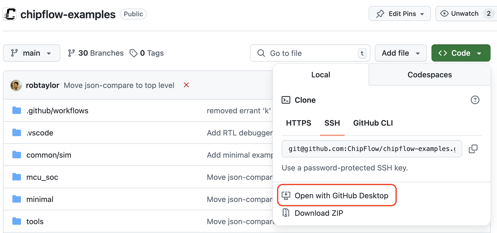
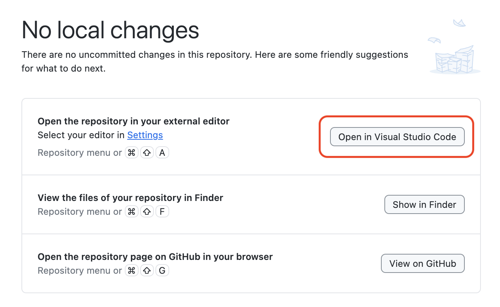
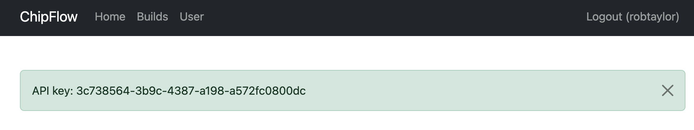

# ChipFlow Examples

## Install Requirements
 * Install the latest version of Python: [Python Downloads](https://www.python.org/downloads/).
 * Ensure you have git command line tools installed: [Git Downloads](https://git-scm.com/downloads).
 * We recommend VS Code as a development environment: [VSCode Downloads](https://code.visualstudio.com/download).
 * GitHub Desktop is a great tool for cloning git repos: [GitHub Desktop Downloads](https://desktop.github.com/download/)

## Clone this repository
If you're familiar with the [Git](https://git-scm.com/) command line then you'll know what to do, otherwise install [GitHub Desktop](https://github.com/apps/desktop). Once its installed, launch it. You will be asked to sign in or create an account - we recommend you take this moment to create a GitHub account if you don't already have one.

Come back to [this page](https://github.com/ChipFlow/chipflow-examples) and click the green 'Code' button at the top. Select  'Open with GitHub Desktop' and then follow the prompts (N.B. your web browser may have a pop-up to authorise opening an external app)


Once GitHub Desktop has cloned your repo you can click the button to open it in VS Code:


## Install the dependencies
In VS Code, open up a terminal from the title menu bar, or using a terminal of your choice.

We use [PDM](https://pdm-project.org) to manage our dependencies, so this will need to be installed. Follow the [PDM install instructions](https://pdm-project.org/en/latest/#installation)

Once PDM is installed, make sure your in the `chipflow-examples` directory and then run:
```
pdm lock -d
pdm install
```

## Set up the environment
Generate your API key at https://build.chipflow.org/user/detail. Click on 'Create/Refresh API Key', and your new API key will appear at the top. Copy it now, as you will not see it again!



Create a file called `.env` at the top level in the `chipflow-examples` directory, containing the line below, substituting your key from the page above:

```
CHIPFLOW_API_KEY=<Paste your key here>
```

## Running a chip build

First choose a design to test. Here we will use the `minimal` design.

Change into the `minimal` directory in `chipflow-examples` to use this design. Now we need to 'lock' our pins - the ChipFlow tooling will then automatically allocate inputs and outputs from your design to pins on the chip.

```
pdm run chipflow pin lock
```

We can now simulate and test the design by running:
```
make sim-check
```

You should see the simulation model being built and run - and a small test firmware running on the simulated System-on-a-Chip (aided by our local friendly cat!)

```
pdm run chipflow sim
-- build_sim_cxxrtl
-- build_sim
pdm run chipflow software
-- gather_depencencies
-- build_software_elf
-- build_software
cd build/sim && ./sim_soc
🐱: nyaa~!
SoC type: CA7F100F
Flash ID: CA7CA7FF
Quad mode
pdm run json-compare design/tests/events_reference.json build/sim/events.json
Event logs are identical
```

Now you are ready to try building this design into a chip! To submit your design to ChipFlow Platform where it will be built into GDS, run:

```
pdm run chipflow silicon submit

```
This should return something like:
```
INFO:chipflow_lib.steps.silicon:Submitting c23dab6-dirty for project chipflow-examples-minimal
INFO:chipflow_lib.steps.silicon:Submitted design: {'build_id': '3f51a69c-b3e3-4fd3-88fd-52826ac5e5dd'}
Design submitted successfully! Build URL: https://build-staging.chipflow.org//build/3f51a69c-b3e3-4fd3-88fd-52826ac5e5dd
```

Your design will now start building: pictures and logs of the build are available at build URL that is returned, once it is complete.

If you would like to get the build logs streamed to your command-line, you can instead call:
```
pdm run chipflow silicon submit --wait
```


